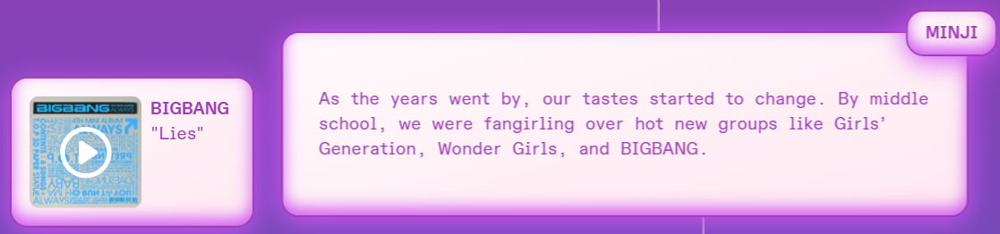
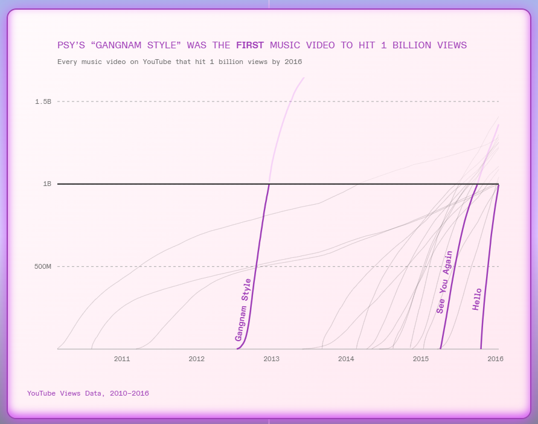
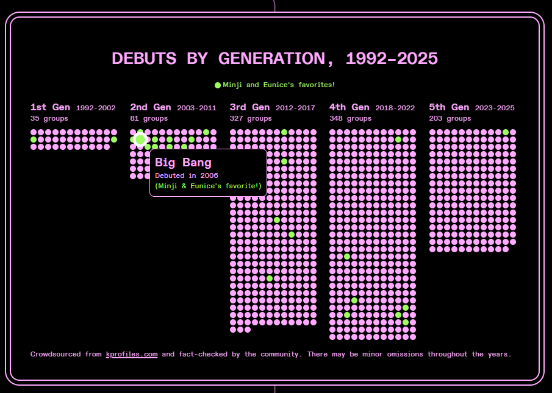
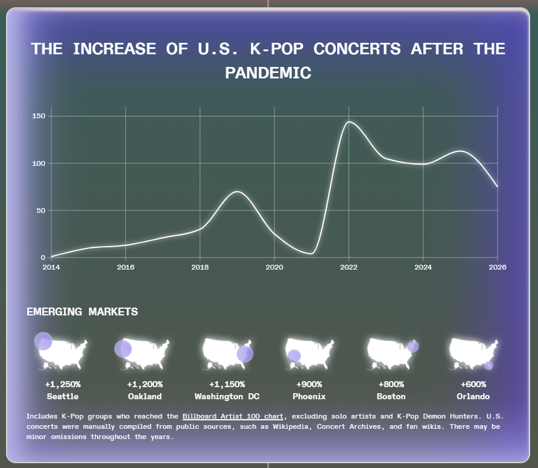
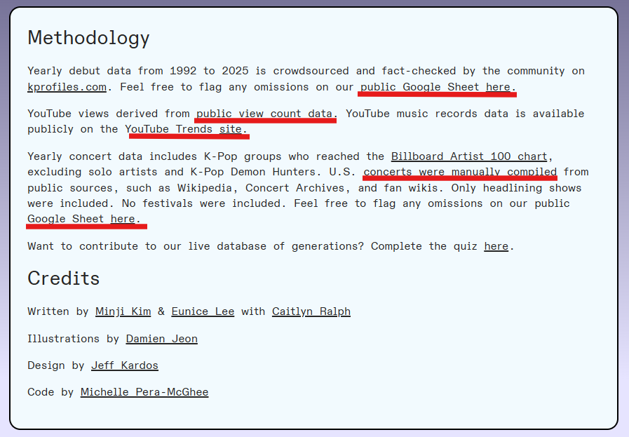
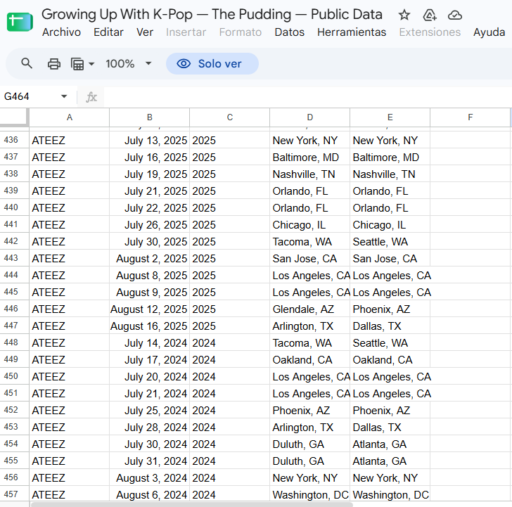

# "Growing Up with K-POP"
Esta webstory ilustra la **evolución de la industria del kpop** a nivel mundial usando como hilo conductor la historia de dos amigas de nacionalidad coreana viviendo en los Estados Unidos [Url de la webstory](https://pudding.cool/2026/05/kpop-generations/)
***

Eunice y Minji usan su historia personal y de amistad para contar la evolución del kpop, desde la música hasta los views y como la cultura coreana llegó a todo el mundo. 
En el relato mezclan el contexto social y conceptos de estudio como _"soft power"_ y el _"Hallyu"_. También abordan la inmigración, siendo ellas inmigrantes coreanas en Estados Unidos. Pero con especial foco en evaluar la evolución histórica del kpop.

### Gráficos e interactividad
La página no es en extremo interactiva, aunque sí es visualmente atractiva a través de los colores y la ilustraciones.
###### No se vuelve monotono a pesar de que hay un claro estilo definido. Por ejemplo, el color de fondo de la página cambia gradualmente de color mientras bajas por ella, y con esto tambien cambia el colos de la letra, más no la tipografía.
A lo largo de la historia el relato va siendo acompañado con cuadros interactivos que reproducen canciones que de la época de la que se está hablando. Pienso que esto más allá de interactuar con el botón de "play" es un recurso ilustrativo y otorga mucho más contexto, con las canciones es evidente el cambio en el género del k-pop al inicio de la historia con respecto al final.

Otro recurso que me pareció interesante fueron los "botones" que te hacen avanzar a segmentos específicos de la historia, en este caso por las 5 generaciones del k-pop

***
En este caso solo utilizaron tres gráficos para destacar datos que parecen relevantes para enfatizar un cambio repentino y muy evidente con respecto a la industria 

###### Este gráfico en particular me gustó, ya que si pones el puntero sobre algún circulo es un grupo de k-pop distinto correspondiente a esa generacion

###### También me gustaron las especificaciones de este gráfico, hacen que la información sea más transparente y más entendible. 

**Creo que es destacable el nivel estético de los gráficos ya que siguen la concordancia de toda la webstory**
***
Al final de la webstory se encuentra este recuadro:

Lo que subrayé en rojo es lo que me llamó la atención. No solo pusieron una "bibliografía" sino que también dejaron a disposisión las tablas con los datos en los que se basaron para los gráficos.

